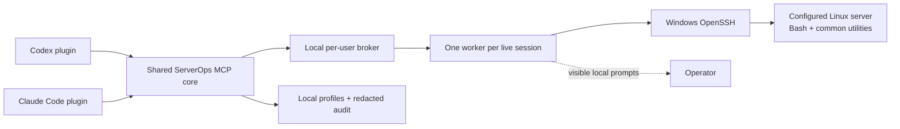

# ServerOps

<!-- mcp-name: io.github.cyyprezz/codex-serverops-mcp -->

[](https://github.com/cyyprezz/codex-serverops-mcp/actions/workflows/ci.yml)
[](https://pypi.org/project/codex-serverops-mcp/)
[](https://pypi.org/project/codex-serverops-mcp/)
[](LICENSE)

Operate the Linux servers you choose from Codex or Claude Code—through normal conversation,
without installing a ServerOps agent on them.

ServerOps keeps useful Bash state between operations, returns structured evidence, and opens
visible local windows when OpenSSH or sudo needs input. It is for freelancers, agencies, support
teams, project owners, and operators who need reliable server work without living in an SSH
terminal.

## Three promises

### Easy to start

Thin Codex and Claude Code plugins connect to one shared ServerOps core. A guided local assistant
creates explicit server profiles without putting credentials into chat.

### Easy to operate

Ask for an outcome in normal language. ServerOps keeps the working directory and shell environment
in a held Bash session, supports interactive terminal work, and returns bounded, structured
results instead of an uncontrolled wall of terminal text.

### Reliable when outcomes matter

Sessions belong to a local broker-owned worker rather than the disposable MCP process. If the
result of a remote mutation is uncertain, ServerOps reports `outcome_unknown` and never retries it
automatically. Linux permissions, explicit profiles, visible authentication, controlled elevation,
hash preconditions, and a redacted local audit form the trust layer.

## See it in action

These are realistic prompts for the eight tools available today:

```text
List my ServerOps profiles. Do not connect to a server or change anything.
```

```text
Use the customer-web profile. Start read-only, identify the host and current user, then explain
why the service is unhealthy. Narrow the diagnosis with evidence instead of dumping every log.
```

```text
Open the project profile, enter /srv/my-app, inspect the current Git and Compose state, and keep
the session open so we can continue from the same directory.
```

```text
Read /srv/my-app/.env.example with the structured file tool. Propose a minimal change and show me
the observed SHA-256, but do not apply anything until I approve it.
```

See the step-by-step [reproducible demo](docs/demo.md) for expected evidence and safe boundaries.

## Available today

- <!-- capability:profiles -->Explicit profiles and a visible local profile assistant.
- <!-- capability:broker_sessions -->Broker-owned, stateful Bash sessions with completed-command
  and interactive-terminal modes.
- <!-- capability:mcp_restart_rediscovery -->Rediscovery after an MCP-client restart when the
  optional managed broker task is installed and the broker, worker, and Bash remain alive.
- <!-- capability:unknown_outcomes -->Explicit unknown-outcome errors with no automatic retry of
  uncertain mutations.
- <!-- capability:structured_files -->Bounded structured UTF-8 text operations inside configured
  roots, with optional SHA-256 preconditions for edits.
- <!-- capability:visible_auth -->Visible local OpenSSH authentication and host-key decisions,
  plus guided sudo and optional root sessions.
- <!-- capability:local_audit -->Redacted local JSONL audit events without remote output or file
  contents.
- <!-- capability:shared_core -->One eight-tool MCP core with thin Codex and Claude Code wrappers.
- <!-- capability:automatic_bootstrap -->Automatic, idempotent local bootstrap on first MCP start.
- <!-- capability:claude_plugin -->A native Claude Code marketplace and plugin beside Codex.
- <!-- capability:no_remote_agent -->No ServerOps agent or daemon installed on the Linux server.

The current runtime is Windows-first and uses Windows OpenSSH to reach Linux. The detailed
[tool reference](docs/tool-reference.md) defines the exact operations and schemas.

## Codex quickstart

Install the repository marketplace and plugin. The pinned `0.1.1` MCP creates its own local state
on first start; no prior setup command is required:

```powershell
codex plugin marketplace add cyyprezz/codex-serverops-mcp
codex plugin add codex-serverops-mcp@serverops-codex
```

Start a new Codex task. Do not add a separate user-wide `[mcp_servers.serverops]` block when using
the plugin. If a previous installer created that alternative block, preview its removal with
`serverops-install codex-config --remove`, then repeat with `--apply` only after review. This keeps
profiles and audit data. Begin without contacting a server:

```text
List my ServerOps profiles. Do not create, edit, remove, test, or connect to a profile. If no
suitable profile exists, wait for me to provide non-secret suggestions before opening the visible
profile assistant. Credentials and host-key decisions belong only in the local ServerOps window.
```

## Claude Code quickstart

The Claude Code wrapper uses the same pinned `0.1.1` runtime and client-neutral skills:

```powershell
claude plugin marketplace add cyyprezz/codex-serverops-mcp
claude plugin install serverops@serverops-claude
```

If the GitHub shorthand requires an SSH key that is not configured, add the marketplace through
HTTPS instead:

```powershell
claude plugin marketplace add https://github.com/cyyprezz/codex-serverops-mcp.git
```

Start a new Claude Code session (or reload plugins) and use the same safe first prompt.

## Automatic local bootstrap

Version `0.1.1` starts without a separate setup command. MCP, broker, setup, check, Doctor, and
update share one idempotent bootstrap that prepares only ServerOps-owned local state: the app,
configuration, runtime, audit, migration, and status paths for the current user.

The bootstrap does **not** edit Codex or Claude configuration, install a Scheduled Task, create a
profile, contact a server, request administrator rights, or overwrite an unmanaged file. The
visible profile assistant remains the first possible server contact.

The explicit `serverops-install setup` command remains compatible and idempotent for maintenance
and for previewing the optional broker task; it is no longer a plugin prerequisite.

## Optional installer and broker task

The version-pinned installer can check the shared runtime or a client path:

```powershell
uvx --from "codex-serverops-mcp==0.1.1" serverops-install check --client core
uvx --from "codex-serverops-mcp==0.1.1" serverops-install doctor --client claude
```

`doctor --client codex` also checks the alternative installer-managed user configuration. A
plugin-only Codex installation can therefore warn that this optional block is absent; that warning
does not prove the plugin is broken.

Install the managed current-user broker task only when live sessions must be reliably rediscovered
after an MCP client process restarts. Preview first, then apply explicitly:

```powershell
uvx --from "codex-serverops-mcp==0.1.1" serverops-install setup --broker-task
uvx --from "codex-serverops-mcp==0.1.1" serverops-install setup --broker-task --apply
```

The task requests no administrator elevation and stores no password. It does not make sessions
survive a Windows reboot or broker crash; the current broker does not adopt orphaned workers.

## Typical workflows

### Customer server check

Select the named customer profile, start read-only, confirm target and identity, inspect only the
relevant service evidence, and report facts, hypotheses, gaps, and any changes separately.

### Remote project work

Enter a project directory once, retain its shell environment across calls, run bounded commands,
and use structured file reads or preconditioned text edits for configured paths.

### Interactive or longer-running work

Use the terminal only when a command genuinely needs interaction, incremental output, interrupt,
resize, or retained terminal state. Completed commands can run for up to the configured maximum of
3600 seconds and return exit code, duration, CWD, and truncation state.

### Configured remote files

List, inspect, search, read, hash, write, patch, rename, create, or remove UTF-8 text paths inside a
profile's configured roots. These roots constrain the structured file tools; they do not sandbox
shell commands or replace backups.

### Authentication and sudo

Passwords, key passphrases, host-key decisions, and interactive sudo input stay in separate visible
local windows. ServerOps can use existing OpenSSH behavior or guide a controlled key transition.
Sudo remains governed by the server's PAM and sudoers policy.

## One-off SSH command or ServerOps?

| Need | `ssh host "command"` | ServerOps |
|---|---|---|
| One isolated command | Smallest direct option | Works, but often unnecessary |
| Keep CWD and shell environment | Reconstruct it each time | Held in one live Bash session |
| Interactive terminal control | Requires a terminal workflow | Cursor reads, input, interrupt, resize, status |
| Structured text files | Parse and quote shell output | Bounded results and optional hash preconditions |
| Authentication prompts | Terminal-owned | Separate visible local windows |
| Uncertain remote mutation | Operator must reason from transport loss | Explicit unknown-outcome result; no automatic retry |
| Continue after MCP restart | New SSH command | Rediscoverable with the optional broker task while processes remain alive |

ServerOps does not replace SSH. It uses OpenSSH and adds a stateful, structured boundary for AI-led
operations where repeated one-off commands become fragile or difficult to review.

## Architecture



The MCP process exposes eight tools. The broker owns session routing, each worker owns exactly one
SSH/Bash process, and no ServerOps component is installed remotely. See
[Architecture](docs/architecture.md) and [Broker lifecycle](docs/broker.md).

## Requirements and honest limits

- Windows 10 or 11, Python 3.12, `uv`/`uvx`, and Windows OpenSSH Client for the current release.
- An SSH-accessible Linux account with Bash; structured files require the common utilities listed
  in [Structured remote files](docs/structured-files.md).
- ServerOps is alpha software. Start with a disposable or non-production account and narrow Linux
  permissions.
- Stateful means process-held: no durable jobs, resume after reboot, or worker adoption after a
  broker crash.
- Structured files are bounded UTF-8 text operations, not binary or resumable transfers and not a
  transactional filesystem.
- `allowed_roots` constrain only structured file tools. Shell commands retain the SSH user's real
  permissions.
- ServerOps makes no exactly-once promise. A timeout or connection loss after delivery can leave an
  effect unknown and requires read-only verification.
- First-class clients today are Codex and Claude Code. Claude Desktop, Cherry Studio, and other
  desktop-client onboarding are planned, not shipped.
- There is no `ServerOpsSetup.exe` yet; the public release requires Python 3.12 and `uvx`.

## Capability status

| Capability | Status | Boundary |
|---|---|---|
| Profiles, completed commands, interactive terminal | Available | Eight-tool MCP core |
| Stateful broker-owned sessions | Available | While broker, worker, and Bash remain alive |
| MCP-restart rediscovery | Available | Requires optional managed broker task for reliability |
| Structured UTF-8 text files | Available | Configured roots, bounded data, optional SHA-256 preconditions |
| Visible auth, guided sudo, local audit | Available | Local trust layer; Linux policy remains authoritative |
| Codex plugin | Available in 0.1.1 | Exact `0.1.1` runtime pin |
| Claude Code plugin | Available in 0.1.1 | Exact `0.1.1` runtime pin |
| Automatic local bootstrap | Available in 0.1.1 | No setup prerequisite; own state only |
| <!-- planned:windows_exe -->`ServerOpsSetup.exe` and self-contained Windows runtime | Planned 0.1.2 | No Python/uv prerequisite after delivery |
| <!-- planned:persistent_jobs --><!-- planned:eventlog --><!-- planned:log_engine --><!-- planned:binary_resume_transfers -->Persistent jobs, receipts, eventlog, logs, resumable transfers | Planned 0.2 | Durable operation state, not command wrappers |
| <!-- planned:incident_system -->Persistent investigations and incident timelines | Planned 0.3 | Built on the operation store |
| <!-- planned:fleet_rollouts --><!-- planned:transactional_changes -->Transactional changes and fleet rollouts | Planned 0.4 | Preconditions, verification, compensation; no exactly-once claim |
| <!-- planned:backup_assurance --><!-- planned:native_database_adapters -->Backup assurance and native database adapters | Planned 0.5 | Only where shell prompting is insufficient |

The machine-readable [capability contract](docs/capabilities.json) keeps this table, evidence paths,
tool names, marketplace identities, and public version pins testable.

## Roadmap

- **0.1.1A:** Claude Code, neutral branding, automatic local bootstrap, project foundations.
- **0.1.1B:** this evidence-led product presentation and reproducible demo.
- **0.1.1C:** synchronized version pins, clean-machine cold starts, lifecycle regressions,
  commit-bound release evidence, and publication hardening.
- **0.1.2:** self-contained Windows packaging, graphical onboarding, and explicitly confirmed
  desktop-client integration.
- **0.2–0.5:** durable operations, investigations, fleet-safe changes, backup assurance, and narrow
  native adapters.

See [ROADMAP.md](ROADMAP.md) for the phase definitions. Planned items are not available features.

## Documentation and project

- [Getting started](docs/getting-started.md) and [reproducible demo](docs/demo.md)
- [Installation, update, Doctor, and uninstall](docs/installation.md)
- [Profiles](docs/configuration.md), [tools](docs/tool-reference.md), and
  [troubleshooting](docs/troubleshooting.md)
- [Authentication](docs/authentication.md), [elevation](docs/elevation.md),
  [structured files](docs/structured-files.md), and [security model](docs/security.md)
- [Architecture](docs/architecture.md), [ADRs](docs/adr/README.md), and
  [release evidence](docs/release-evidence.md)
- [0.1.1 release notes](docs/release-notes-0.1.1.md),
  [migration and rollback](docs/migration-rollback-evidence.md), and
  [release checklist](docs/release-candidate-checklist.md)
- [Changelog](CHANGELOG.md), [artifact plan](docs/artifact-plan.md), and
  [contributing guide](CONTRIBUTING.md)

For support, open a [GitHub issue](https://github.com/cyyprezz/codex-serverops-mcp/issues) without
credentials, private keys, customer hostnames, or production output. Report vulnerabilities through
[SECURITY.md](SECURITY.md). ServerOps is available under the [MIT License](LICENSE).
